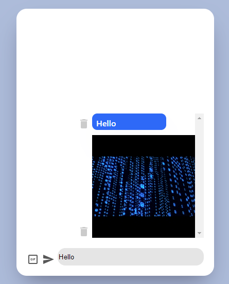

#  A simple UI where user can type in a text and also insert a GIF image by clicking a button and searching for a GIF.  

## Deployed link : https://giphy-eight.vercel.app/
## Video Link: https://drive.google.com/file/d/1UXrBymgbNiBb40kxxhrpycY8IAnADIbq/view   (Duration: 0.53s)

## Tech Stack Used
* HTML
* CSS
* JavaScript
* React Js
* MUI Icons
*https://developers.giphy.com/docs/api#quick-start-guide( Integrated a feature from "giphy" for searching a gif )

## Instructions/Features :

* Search any giphy by clicking on giphy icon and also when you click on it, it will automatically be added to Message Box.
* You can type anything in input and click on ENTER icon to add this to post.
* You can delete the messages or gif by clicking on the Delete icon
* Website is Completely responsive in nature and also expected to have some more features in future.